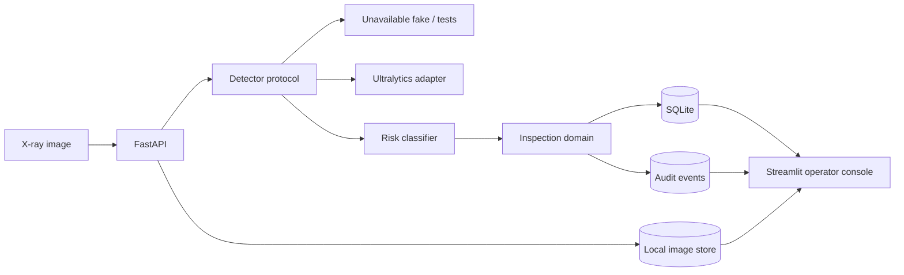

# Architecture

## v0.1 boundary

The domain never imports Ultralytics. Detection candidates cross a small local
contract and become domain detections only after the operational risk policy is
applied.

Model failure is fail-safe: a pending inspection becomes
`manual_review_required`, rather than silently clearing an image or crashing
the entire service.

Image bytes are stored outside SQLite under a configurable local root. SQLite
stores only the UUID-based storage key and media metadata. Audit events are
append-only records ordered by occurrence time. Both use separate tables, so
the original inspection table remains compatible with the initial scaffold.

## Implemented since the initial scaffold

- Local PIDray subset preparation and a versioned CPU YOLO26n baseline.
- Bounding-box rendering, review calls, inspection history, and audit events in
  the Streamlit operator console.
- Separate SQLite records for inspections, image references, and audit events.

## Remaining work

- Compare raw, CLAHE, and denoise+CLAHE inputs using fixed train/evaluation
  splits; no enhancement is currently enabled in the inference path.
- Evaluate larger or complete hard and hidden splits and investigate the weak
  knife/lighter results.
- Production requirements such as authentication, alerting, and a production
  database are out of scope for the current portfolio prototype.
- C++/OpenCV acceleration and .NET orchestration remain later-stage options,
  contingent on profiling and product needs.
