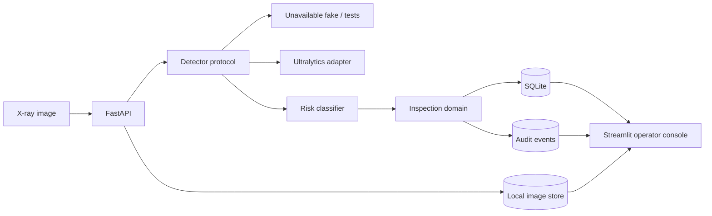

# Architecture

## v0.1 boundary

The domain never imports Ultralytics. Detection candidates cross a small local
contract and become domain detections only after the operational risk policy is
applied.

Model failure is fail-safe: a pending inspection becomes
`manual_review_required`, rather than silently clearing an image or crashing
the entire service.

Image bytes are stored outside SQLite under a configurable local root. SQLite
stores only the UUID-based storage key and media metadata. Audit events are
append-only records ordered by occurrence time. Both use separate tables, so
the original inspection table remains compatible with the initial scaffold.

## Deferred intentionally

- PIDray download and redistribution decision.
- Real training and model weights.
- Bounding-box rendering and review calls from Streamlit.
- Audit-event table, observability, authentication, and production database.
- C++ preprocessing and .NET orchestration (post-v0.1 only).
